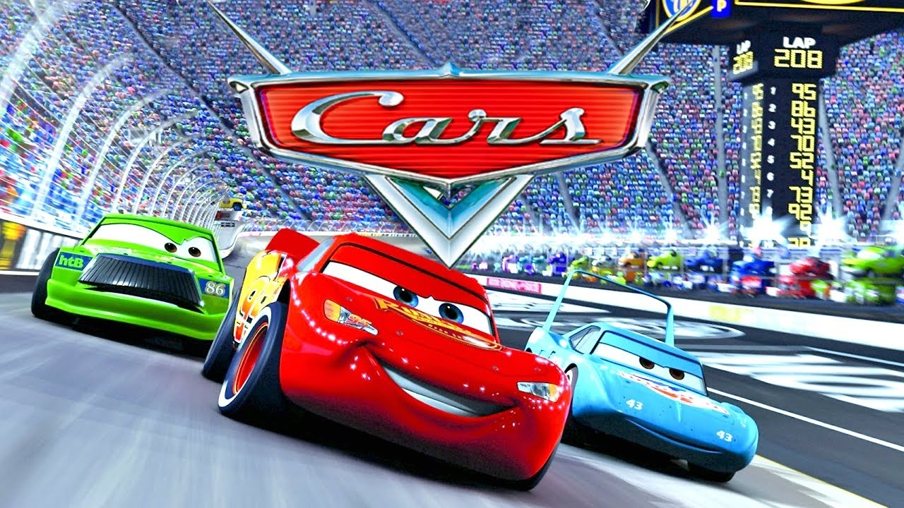

#CARS
---

---
##Sinopsis:
El valiente Rayo McQueen (con la voz de OWEN WILSON), un coche de carreras novato y apasionado descubre que el camino se hace andando, cuando se encuentra perdido en la ciudad fantasma Radiator Springs de la Ruta 66. Atravesando el país en dirección al gran Campeonato de la Copa Piston en California para competir con dos veteranos, McQueen conoce a los originales personajes que habitan en la ciudad incluida Sally (un llamativo Porsche de 2002 con voz de BONNIE HUNT), Doc Hudson (un Hudson Hornet de 1951 con un misterioso pasado, con la voz de PAUL NEWMAN), y Mater (una leal grúa oxidada con la voz de LARRY THE CABLE GUY). Todos ellos le ayudarán a comprender que hay cosas más importantes que conseguir premios, fama y patrocinios. Este reparto plagado de estrellas también incluye las actuaciones de leyendas de las carreras de coches como Richard Petty y Cheech Marin. Llena de humor, acción, sentimientos y verdaderas proezas técnicas, CARS es una película de alta velocidad para espectadores de todas las edades.

* `Protagonista;` Rayo Mcqueen
* `Any:` 2006
* `Nota:` 8,4

