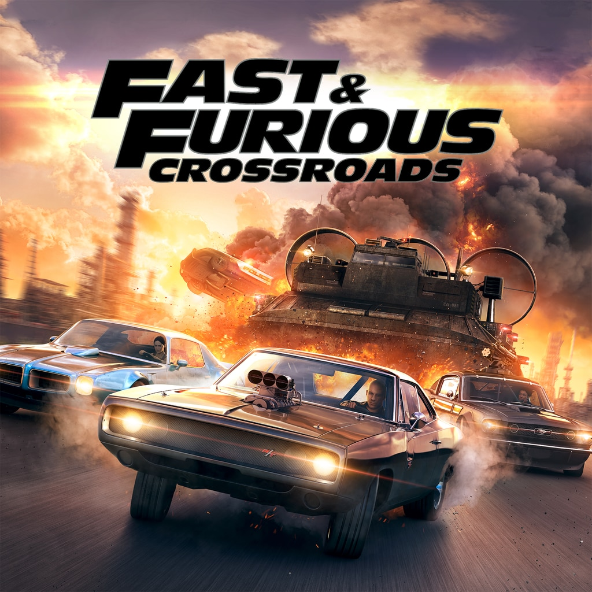

#Fast&Furious
---

---
##Sinopsis:
La vida de Dominic Toretto (Vin Diesel) está marcada día y noche por la velocidad. Durante el día prepara y tunea coches de carreras de alta gama, mejora sus prestaciones y los embellece. Al caer la noche se organizan competiciones ilegales donde muchos candidatos se enfrentan sin contemplaciones bajo la intensa mirada de sus groupies. Dominic Toretto compite en ellas con su propio bólido a 280 kilómetros por hora, consiguiendo numerosas sumas de dinero gracias a sus victorias.

Sin embargo, existe una banda de delincuentes muy misteriosa que roba camiones en marcha desde vehículos deportivos. Este hecho hace que la policía infiltre a uno de sus hombres dentro de las carreras ilegales para investigar a posibles sospechosos. Brian (Paul Walker) es el encargado de infiltrarse en la banda de Toretto, la que figura junto a la de su rival Johnny Tran como principales sospechosos. Rápidamente se ganará la confianza de Toretto, pero todo se complicará cuando aparezca su hermana y se enamora de ella.

* `Protagonista;` Vin Diesel
* `Any:` 2001
* `Nota:` 7

